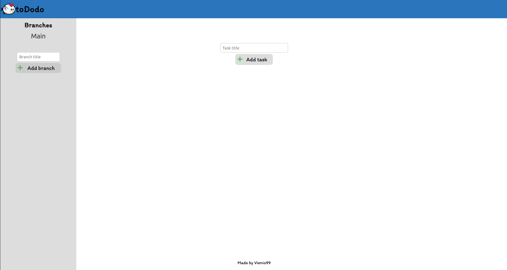

<h1>Todo list</h1>

Project to make todo list app.

From The Odin Project's <a href="https://www.theodinproject.com/paths/full-stack-javascript/courses/javascript/lessons/todo-list">curriculum.</a>

<h2>Built with</h2>
<h3>Technologies</h3>
  <ul>
    <li>JS</li>
    <li>HTML</li>
    <li>CSS</li>
  </ul> 
<h3>Tools</h3>
  <ul>
    <li>Webpack</li>
    <li>Visual Studio Code</li>
    <li>Linux Terminal</li>
    <li>Git and Github</li>
  </ul> 
<h3>Third party code</h3>
  <ul>
    <li><a href="https://fonts.google.com/">Google Fonts</a></li>
  </ul> 
<h2>Home page</h2>
</img>
<h2>Author</h2>

<a href="https://github.com/Vienio99">Vienio99</a>

